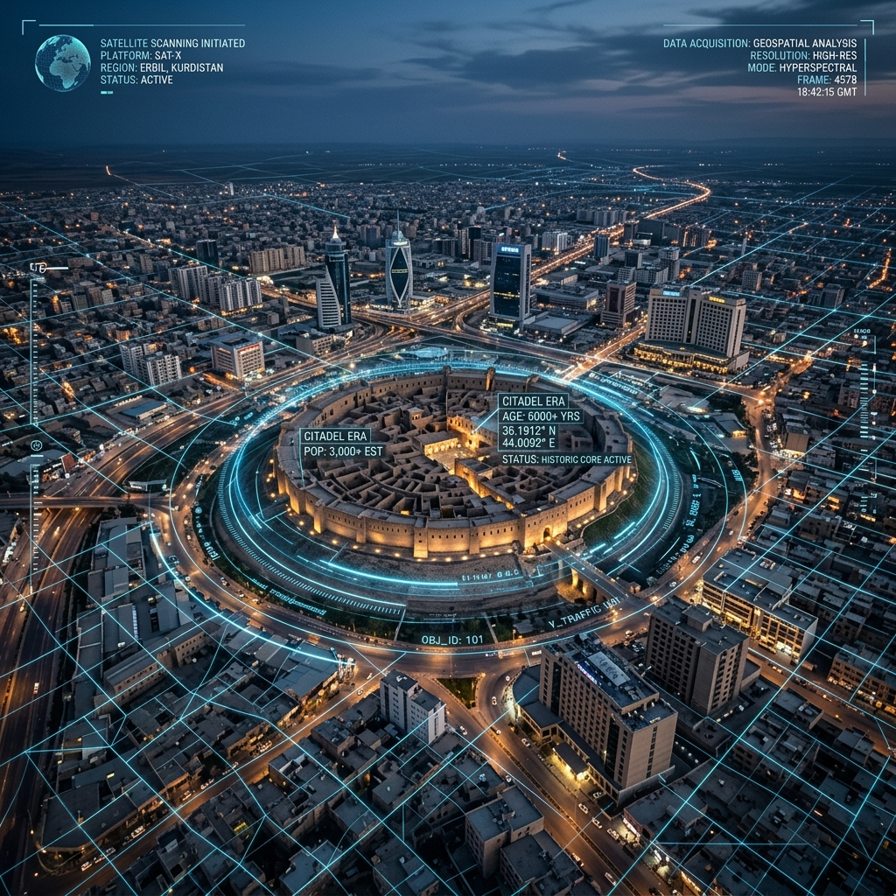

# Illegal Building Detection (Erbil City)



**🎓 Institution:** Al-Farabi University  
**👥 Team:** Abdulrahman Ahmed Turki, Mohammed Natiq Hilo, Mustafa Ahmed Najah  
**📊 Performance:** Validation Loss `0.0007` (Trained on 7,500 real-terrain image pairs over 8 epochs)

An AI-powered municipal oversight platform designed to automatically detect unauthorized construction using satellite imagery. Built specifically for the **First Annual Student Forum for AI Projects** at the University of Baghdad, College of Artificial Intelligence.

---

## 🚀 Live Demo

**[Link to Hugging Face Spaces Demo (TBD)](#)**

*This project is ready to be deployed to Hugging Face Spaces using the provided `app.py` and `requirements.txt`.*

---

## 🏆 Project Judging Criteria

This project was developed addressing the core evaluation criteria of the forum:

### 1. Innovation and Originality (10 Points)
- **Distinction**: Unlike traditional manual city surveying which is slow and labor-intensive, this project utilizes automated temporal image analysis.
- **New Idea**: We implement a true **Siamese Convolutional Neural Network (CNN)** using PyTorch. By feeding two satellite images (T0 and T1) into the network simultaneously, the system computes the deep feature distance to isolate newly constructed buildings while ignoring seasonal changes.

### 2. Technical Mastery and Implementation (30 Points)
- **Modern Programming & UI**: The application is built using **Python** and **Streamlit**, featuring a highly customized, premium CSS frontend designed to look like a professional municipal dashboard.
- **AI Algorithms**: The core logic relies on a custom PyTorch Siamese CNN (Encoder-Decoder) trained from scratch. The system includes a full training pipeline (`train.py`, `dataset.py`, `model.py`) demonstrating true Deep Learning implementation.

### 3. Practical Application (35 Points)
- **Solving a Problem**: Erbil city is expanding rapidly. Unauthorized construction leads to poor urban planning and lost municipal revenue. This system allows the municipality to scan entire sectors instantly.
- **Realism & Sustainability**: The solution requires only satellite imagery (which is readily available via APIs like Google Earth Engine or Planet) and standard computing resources, making it highly sustainable for government use.

### 4. Presentation and Delivery (15 Points)
- **Clarity & Prototype**: The Streamlit dashboard is designed for an interactive, smooth presentation. It clearly displays the "Baseline" and "Recent" images, with a dynamic "Run Analysis" button that yields clear, actionable metrics (Number of violations, total area changed, and confidence scores).

### 5. Ethics and Integrity (10 Points)
- **Privacy**: The system strictly analyzes structural data from macroscopic satellite views. It does not process facial recognition, personal identification, or any private citizen data.
- **Integrity**: The algorithmic approach is objective. It flags *all* structural changes regardless of neighborhood, ensuring fair and unbiased municipal oversight.

---

## 🛠️ How to Train and Run Locally

1. **Clone the repository:**
   ```bash
   git clone <your-github-repo-url>
   cd illegal-building-detection
   ```

2. **Install dependencies:**
   ```bash
   pip install -r requirements.txt
   ```

3. **Generate the Semi-Synthetic Erbil Dataset and Train the Model:**
   *Because downloading massive, high-res historical datasets of Erbil costs thousands of dollars, this project includes an intelligent automated pipeline. It directly connects to public ArcGIS servers, downloads thousands of real Erbil satellite tiles, mathematically injects new building constructions to create a semi-synthetic dataset, and then trains the PyTorch model.*
   ```bash
   python fetch_erbil.py
   python generate_dataset.py
   python train.py
   ```
   *This will generate the dataset and output `erbil_siamese_model.pth`.*

4. **Run the Streamlit app:**
   ```bash
   streamlit run app.py
   ```

## 📂 Project Structure
- `app.py`: The main Streamlit application containing the UI and inference logic.
- `model.py`: PyTorch implementation of the Siamese CNN.
- `dataset.py`: PyTorch DataLoader for the image pairs.
- `train.py`: The training loop for the neural network.
- `fetch_erbil.py`: Connects to ArcGIS servers to download real Erbil satellite tiles.
- `generate_dataset.py`: Injects "new" buildings onto real Erbil terrain to create a semi-synthetic training dataset.
- `requirements.txt`: Python dependencies.
- `README.md`: Project documentation.
- `sample_data/`: Contains example 'Before' and 'After' satellite images for testing the demo.

## 🎓 University
**Al-Farabi University**

## 👥 Team
1. **Abdulrahman Ahmed Turki**
2. **Mohammed Natiq Hilo**
3. **Mustafa Ahmed Najah**
